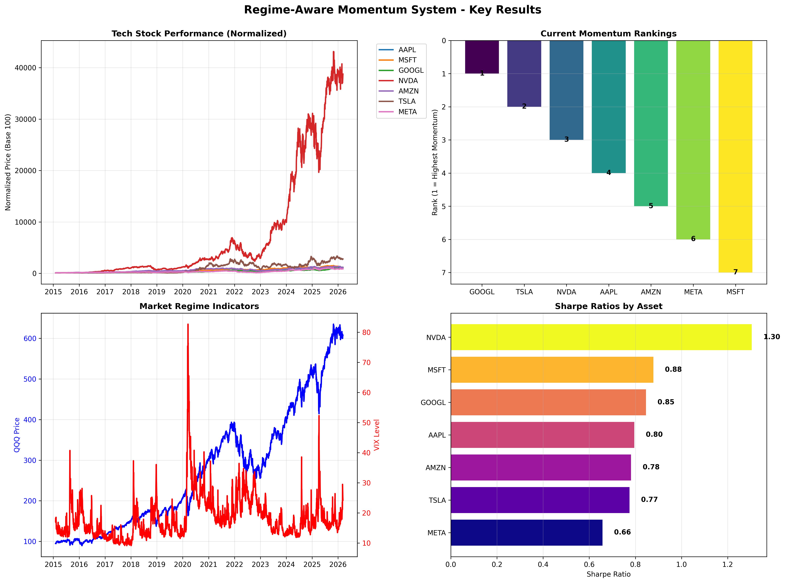
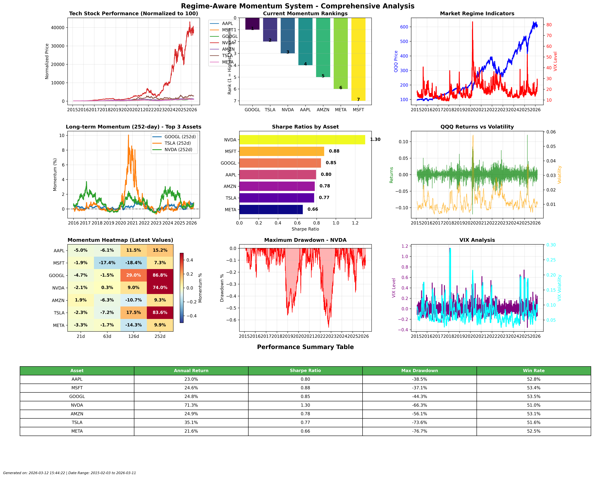

# Regime-Aware Momentum System

A sophisticated momentum-based trading system that uses Hidden Markov Models (HMM) to detect market regimes and adapt momentum strategies accordingly.

## Background

My personal portfolio is heavily concentrated in tech stocks (Google, Meta, Nvidia, Microsoft, Amazon, Tesla, QQQ, etc.). The reason is simple:

1. **I believe in the future of tech** - I believe AI will replace many manual tasks and generate substantial revenue
2. **I understand the tech sector** - I read tech-related news and constantly think about how semiconductors, AI, and other sub-sectors interact

I want to build a trading strategy that gives me indications on how and when to trade. I use HMM because it's explainable and statistically significant. Markets have hidden regimes (bull, bear, choppy) that I can't observe directly. I only see prices and volatility. HMM is designed for inferring hidden states from noisy observations over time. I can interpret the transition dynamics.

## What It Is

This is a 3-state Hidden Markov Model using daily returns of QQQ (Nasdaq 100 ETF) and VIX levels to detect three regimes:

- **Risk-On**: High returns, low volatility
- **Neutral**: Mixed characteristics  
- **Risk-Off**: Negative returns, high volatility

The system plots the regimes over time from 2015-2025, providing a framework for understanding market states and making informed trading decisions.

## Limitations

### Current Limitations

In the future, I want to experiment with different inputs beyond just VIX and QQQ:

- **Circular Dependence**: QQQ has circular dependence with the stocks I've chosen since many tech stocks are components of QQQ
- **Limited Signal Diversity**: Need additional uncorrelated signals for better regime detection

### Future Model Exploration

I want to use and compare different types of models:

- **Regression Models**: For baseline comparisons
- **GARCH Models**: For volatility modeling
- **Markov Switching Models**: Alternative regime detection with economic interpretability
- **Machine Learning**: XGBoost or Random Forest for non-linear pattern recognition

### Potential Input Enhancements

- **VT (Total World Stock ETF)**: Broader market exposure beyond Nasdaq
- **War-related data**: Geopolitical risk indicators
- **Oil-related data**: Energy sector correlations
- **Additional volatility measures**: Beyond just VIX

## Overview

This system combines momentum investing with regime detection to create a more robust trading strategy. By identifying different market states (bullish, bearish, volatile), the system can adjust its momentum approach to better suit current market conditions.

## Key Features

- **Multi-Asset Momentum**: Tracks momentum across major tech stocks (AAPL, MSFT, GOOGL, NVDA, AMZN, TSLA, META)
- **Regime Detection**: Uses QQQ and VIX to identify market states using Hidden Markov Models
- **Adaptive Strategy**: Adjusts momentum strategy based on detected market regime
- **Comprehensive Data Pipeline**: Automated data fetching, validation, and processing
- **Performance Analytics**: Detailed performance metrics and visualization

## System Architecture

```
regime_momentum_system/
├── config/
│   └── settings.py          # Configuration parameters
├── data_pipeline/
│   ├── data_fetcher.py      # Fetches financial data from yfinance
│   ├── data_validator.py    # Validates data quality and completeness
│   ├── data_processor.py    # Calculates momentum metrics
│   └── pipeline.py          # Main pipeline orchestrator
├── momentum_strategy/
│   └── __init__.py          # Momentum strategy logic
├── regime_detection/
│   └── __init__.py          # HMM regime detection (placeholder)
└── backtesting/
    └── __init__.py          # Backtesting framework (placeholder)
```

## Installation

1. Clone the repository:
```bash
git clone https://github.com/oliviaszh/hidden-markov-regime-detection-tech-stock-trading.git
cd hidden-markov-regime-detection-tech-stock-trading
```

2. Install dependencies:
```bash
pip install yfinance pandas numpy scikit-learn matplotlib
```

## Usage

### Quick Start

Run the data pipeline to generate fresh data and visualizations:

```bash
# Generate comprehensive analysis
python3 plot_results.py

# Generate simple key results
python3 simple_plots.py

# Run basic pipeline test
python3 test_pipeline.py
```

### Data Pipeline

The data pipeline handles all data operations:

```python
from regime_momentum_system.data_pipeline.pipeline import DataPipeline

# Initialize pipeline
pipeline = DataPipeline()

# Run complete pipeline
dataset = pipeline.run_pipeline()

# Get momentum rankings
rankings = pipeline.get_momentum_rankings()

# Get performance metrics
metrics = pipeline.get_performance_metrics()
```

### Configuration

Modify `regime_momentum_system/config/settings.py` to customize:

- **Assets**: Tech stocks and regime detection assets
- **Date Range**: Historical data period
- **Momentum Periods**: Lookback periods for momentum calculation
- **HMM Parameters**: Regime detection model settings

## Results

### Current Momentum Rankings



### Comprehensive Analysis



### Key Performance Metrics

Based on the latest analysis (2015-2026):

- **Analysis Period**: February 2015 - March 2026 (2,792 trading days)
- **Top Performer**: NVDA with 65.7% annualized return
- **Highest Sharpe Ratio**: NVDA at 1.30
- **Average Daily Volatility**: 2.94%

### Momentum Rankings (Latest)

1. **GOOGL** - Rank 1 (Highest momentum)
2. **TSLA** - Rank 2
3. **NVDA** - Rank 3
4. **AAPL** - Rank 4
5. **AMZN** - Rank 5
6. **MSFT** - Rank 6
7. **META** - Rank 7

## Technical Details

### Momentum Calculation

The system calculates momentum using multiple lookback periods:
- **21 days** (1 month)
- **63 days** (3 months)
- **126 days** (6 months)
- **252 days** (12 months)

Momentum = (Current Price - Price N days ago) / Price N days ago

### Regime Detection

Uses Hidden Markov Models with features:
- QQQ returns (market direction)
- QQQ volatility (market stability)
- VIX levels (market fear/greed)
- VIX volatility (volatility of volatility)

### Data Sources

- **Primary**: Yahoo Finance (yfinance)
- **Assets**: Daily closing prices for tech stocks and market indicators
- **Frequency**: Daily data
- **Validation**: Quality checks for missing data, outliers, and consistency

## Performance Metrics

The system tracks comprehensive performance metrics:

- **Total Return**: Cumulative performance over the period
- **Annualized Return**: Average yearly return
- **Annualized Volatility**: Risk measure
- **Sharpe Ratio**: Risk-adjusted return
- **Maximum Drawdown**: Largest peak-to-trough decline
- **Win Rate**: Percentage of positive daily returns

## Future Development

### Planned Features

1. **HMM Implementation**: Complete Hidden Markov Model for regime detection
2. **Strategy Logic**: Implement momentum strategy with regime adaptation
3. **Backtesting**: Comprehensive backtesting framework
4. **Risk Management**: Position sizing and risk controls
5. **Live Trading**: Integration with brokerage APIs

### Current Status

- ✅ Data pipeline (fetching, validation, processing)
- ✅ Momentum calculations
- ✅ Performance metrics
- ✅ Visualization and analysis
- 🔄 HMM regime detection (in development)
- 🔄 Momentum strategy implementation (planned)
- 🔄 Backtesting framework (planned)

## Contributing

1. Fork the repository
2. Create a feature branch
3. Make your changes
4. Add tests if applicable
5. Submit a pull request

## License

This project is open source and available under the [MIT License](LICENSE).

## Contact

For questions or collaboration, please open an issue or contact the maintainers.

## Dependencies

- **yfinance**: Financial data fetching
- **pandas**: Data manipulation and analysis
- **numpy**: Numerical computing
- **scikit-learn**: Machine learning (for HMM)
- **matplotlib**: Data visualization
- **python-dateutil**: Date handling

## Notes

- The system is currently in development
- HMM regime detection module is a placeholder
- Momentum strategy logic is not yet implemented
- Backtesting framework is planned for future development
- Always perform thorough testing before using in live trading